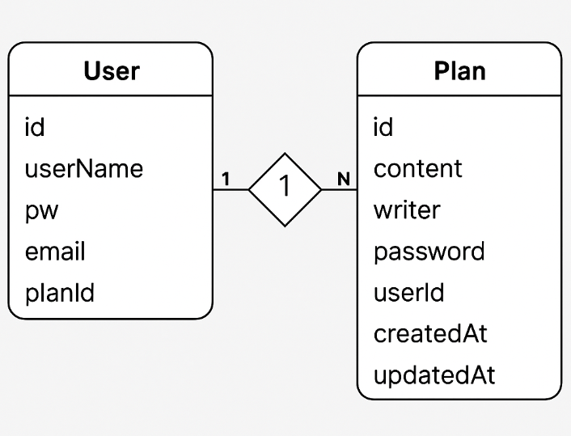

## ERD 다이어그램

## 플래너 API 설계
| 기능            | 메서드    | URL                  | 요청 타입       | 요청 데이터              | 응답 내용                   | 응답 코드      |
| ------------- | ------ | -------------------- | ----------- | ------------------- | ----------------------- | ---------- |
| 사용자 등록        | POST   | `/plans/register`    | JSON Body   | `UserRegisterDTO`   | `UserRegisterDTO`       | 201: 생성됨   |
| 일정 등록 (v1)    | POST   | `/plans`             | JSON Body   | `PlanRequestDTO`    | `PlanResponseDTO`       | 201: 생성됨   |
| 일정 등록 (v2)    | POST   | `/plans/v2`          | JSON Body   | `PlanRequestDTO_V2` | `PlanResponseDTO`       | 201: 생성됨   |
| 일정 목록 조회 (v1) | GET    | `/plans/view`        | Query Param | `writer`, `editAt`  | `List<PlanResponseDTO>` | 200: 정상 조회 |
| 일정 목록 조회 (v2) | GET    | `/plans/view/v2`     | Query Param | `writer`, `editAt`  | `List<PlanResponseDTO>` | 200: 정상 조회 |
| 일정 단건 조회      | GET    | `/plans/{userId}`    | Path Param  | `userId`            | `PlanResponseDTO`       | 200: 정상 조회 |
| 일정 수정         | PUT    | `/plans/edit/{id}`   | JSON Body   | `PlanRequestDTO`    | `PlanResponseDTO`       | 200: 정상 수정 |
| 일정 삭제         | DELETE | `/plans/delete/{id}` | JSON + Path | `PlanDeleteDTO`     | 없음                      | 200: 정상 삭제 |

